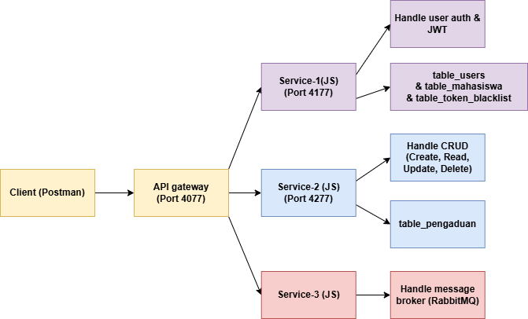

## **Cara Menjalankan Service**
### 1. Persiapan Environment
Sebelum menjalankan layanan, pastikan telah mengonfigurasi file .env dan config.js di setiap folder service sesuai dengan kredensial database MySQL masing-masing. 

### 2. Menjalankan XAMPP
Sebelum menjalankan perintah untuk menyalakan service, pastikan terlebih dahulu start service Apache dan MySQL. Ini bertujuan supaya masing-masing service bisa terhubung ke database di Phpmyadmin (buar service selain yang di folder log-service mesti terhubung ke database).

File .env contoh:

PORT=

DB_HOST=

DB_USER=

DB_PASSWORD=

DB_NAME=

JWT_SECRET=

JWT_ACCESS_SECRET=

JWT_REFRESH_SECRET=

### 3. Menjalankan Service
Masuk ke direktori utama proyek melalui terminal, kemudian install seluruh dependencies yang diperlukan dengan perintah:

`npm install`

Setelah proses instalasi selesai, buka terminal terpisah dan jalankan masing-masing layanan menggunakan perintah:

`node gateway.js` (folder gateway, berjalan di port 4077) 

`node auth.js` (folder auth, berjalan di port 4177)

`node main.js` (folder main, berjalan di port 4277)

`node index.js` (folder log-service)

Pastikan masuk ke dalam folder masing-masing sebelum eksekusi kode diatas untuk menghindari nilai .env masing-masing yang jadi undefined bila di-run di luar folder mereka sendiri.

## **Daftar Endpoint yang Tersedia** 
GET `http://localhost:4077/auth/profile` (akses profil setelah login)

POST `http://localhost:4077/auth//refresh-token` (refresh bila tokennya udah basi)

POST `http://localhost:4077/auth/register` (mendaftar sebagai user mahasiswa)

POST `http://localhost:4077/auth/register-admin` (mendaftar sebagai user admin)

POST `http://localhost:4077/auth/login` (login dengan akun yang sudah di regist)

POST `http://localhost:4077/auth/logout` (logout dengan akun yang sudah di regist)

GET `http://localhost:4077/complaints/laporan` (ambil laporan diri sendiri (mhs) / semua laporan (admin))

POST `http://localhost:4077/complaints/laporan` (buat laporan (mhs only))

PUT `http://localhost:4077/complaints/laporan/:id` (update status laporan (admin only))

DELETE `http://localhost:4077/complaints/laporan/:id` (hapus laporan (admin only))

## **Contoh Request & Response** 
### 1. Login User
Endpoint: POST `http://localhost:4077/auth/login`

Request:

{
    "username": "admin_it", 
    "password": "12345678"
}

Response:

{
    "status": "success",
    "message": "Login Berhasil",
    "data": {
        "user": {
            "id": 4,
            "username": "admin_it",
            "role": "admin"
        },
        "accessToken": "eyJhbG.............................",
        "refreshToken": "eyJhbGc.............................."
    }
}

### 2. Membuat Pengaduan (mahasiswa only)
Endpoint: POST `http://localhost:4077/complaints/laporan`

Headers: Authorization: Bearer <access_token_mhs>

Request:

{
    "id": "3",
    "isi_laporan": "TV di kelas fik 403 error glitch terus"
}

Response:

{
    "status": "success",
    "message": "Laporan berhasil dibuat dan sedang diproses oleh sistem",
    "data": {
        "id": 3,
        "nim": 210101,
        "isi": "TV di kelas fik 403 error glitch terus",
        "status": "pending"
    }
}

### 3. Update Status Laporan (admin only)
Endpoint: PUT `http://localhost:4077/complaints/laporan/:id`

Headers: Authorization: Bearer <access_token_admin>

Request:

{
    "status": "proses"
}

Response:

{
    "status": "success",
    "message": "Status laporan berhasil diperbarui"
}

## **Arsitektur Sistem**
.